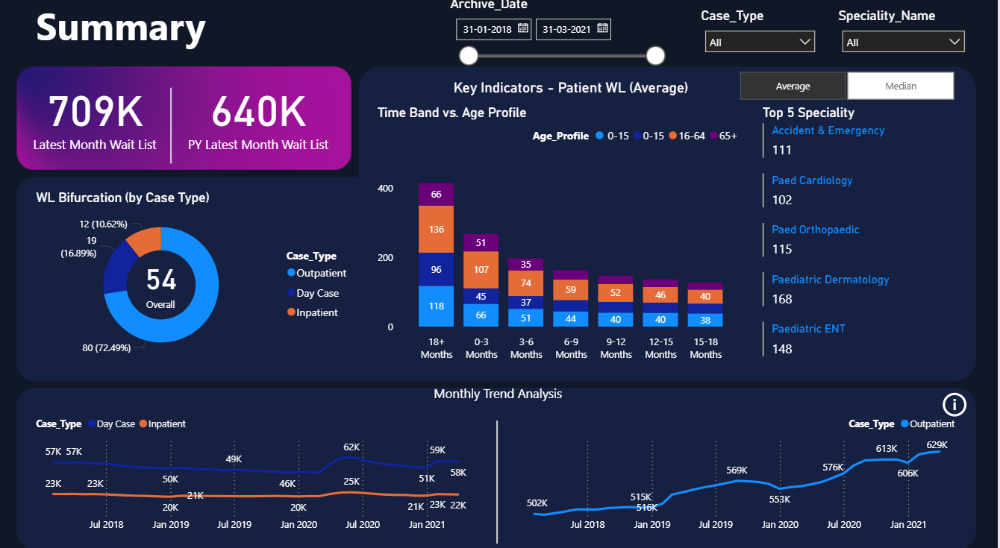

# Hospital Waitlist & Speciality Analysis Dashboard - Power BI

This project is a Power BI dashboard designed to analyze hospital waitlist trends, case type distributions, and speciality performance through dynamic, interactive visuals.
The goal is to help healthcare administrators and decision-makers monitor patient backlogs, identify speciality demands, and improve hospital resource planning.

---

## Key Features

* ✅ **Waitlist Overview**
  Track the latest month’s waitlist compared with the previous year.

* ✅ **Case Type Distribution**
  Breakdown of Outpatient, Day Case, and Inpatient counts with percentage share.

* ✅ **Age Band vs. Waiting Time**
  Explore how patient age groups (0–15, 16–64, 65+) are distributed across different wait time bands.

* ✅ **Top 5 Specialities**
  Identify the specialities with the highest patient volumes for resource prioritization.

* ✅ **Monthly Trend Analysis**
  Track waitlist trends over time across case types for better forecasting.

* ✅ **Dynamic Filtering**
  Apply filters for Archive Date, Case Type, and Speciality to explore data from multiple perspectives.

---

## Project Files

* `Hospital_Waitlist_Speciality_Analysis.pbix` – Power BI file containing the complete dashboard
* `Dataset/` – Sample datasets with hospital waitlist and speciality data
* `README.md` – Documentation with project overview and usage instructions

---

## Use Case

This dashboard is useful for:

* **Hospital Management** – Monitor patient waitlists and speciality workloads
* **Healthcare Planners** – Identify areas with rising demand or backlog
* **Policy Makers** – Track long-term waitlist patterns for healthcare strategy

---

## Tech Stack

* **Power BI Desktop** – for data modeling and interactive reporting
* **DAX** – for calculating averages, medians, and KPIs
* **Excel / CSV datasets** – containing hospital waitlist and speciality details

---

## Screenshot

---

## How to Use

1. Download the `.pbix` file from this repository
2. Open the file in **Power BI Desktop**
3. Connect or load the sample dataset provided
4. Apply filters and interact with the dashboard for insights

---

## License

This project is shared for portfolio and learning purposes.
You are welcome to fork, explore, and improve it.

---

## Author

**Sayed Ibrahim**
Data Analyst | Power BI Developer

Connect on [LinkedIn](https://www.linkedin.com/in/sayed-ibrahim-m-a70828239)
